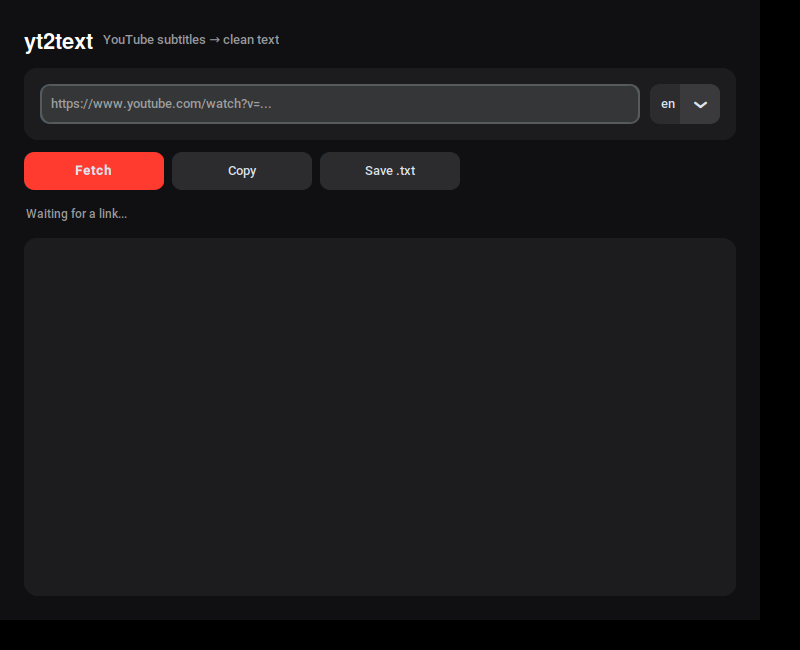

# yt2text

A free, open-source desktop app that turns any YouTube video into clean, readable text.

Paste a link, hit **Fetch**, get the full transcript back — no timestamps, no filler, no ads. Feed it into Claude (or any LLM) to summarize, extract key points, or decide in 30 seconds whether a video is even worth your time.



## Why

Most "watch later" videos never get watched. A 40-minute tutorial competes with a 40-minute block of free time you don't have.

This tool skips the watching part. It pulls the subtitle track YouTube already has — no transcription, no video download — cleans it up, and hands you plain text. Read it in 3 minutes, or paste it into an AI tool and ask for exactly what you need.

## Features

- Works with any YouTube video that has subtitles (manual or auto-generated)
- Prefers manual captions, falls back to auto-generated automatically
- Strips timestamps, formatting tags, and duplicate rolling-caption lines
- Dark-themed desktop GUI — paste, fetch, copy or save
- No account, no API key, no tracking

## Install

Requires Python 3.10+ and `python3-tk` (usually preinstalled on macOS/Windows; on Linux you may need to install it).

```bash
# Linux only — install tkinter if you don't have it
sudo apt install python3-tk -y

# create a virtual environment (recommended)
python3 -m venv ~/yt2text-env
source ~/yt2text-env/bin/activate   # Windows: yt2text-env\Scripts\activate

# install dependencies
pip install -r requirements.txt
```

## Run

```bash
source ~/yt2text-env/bin/activate
python3 yt2text_app.py
```

A window opens. Paste a YouTube URL, pick a preferred subtitle language (defaults to English), and click **Fetch**.

## How it works

YouTube stores subtitle tracks separately from the video stream. [`yt-dlp`](https://github.com/yt-dlp/yt-dlp) requests just that track — no video data is downloaded, which is why fetching is fast. The raw subtitle file (`.vtt`) includes timing data and often repeats lines as captions scroll on screen; this tool strips all of that and keeps only the spoken content, in order, deduplicated.

## License

MIT — do whatever you want with it.

## Built by

[@AkosHladon](https://twitter.com/AkosHladon) — indie developer building micro-SaaS, niche directories, and AI automation pipelines.
